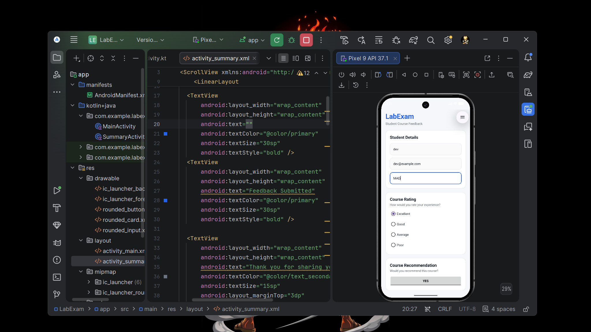
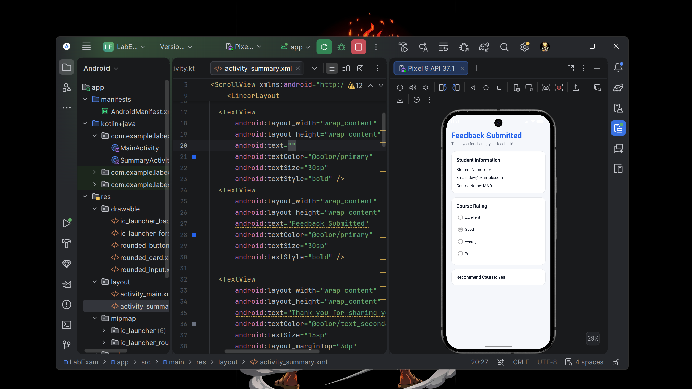

# LabExam 📋

A **Student Course Feedback Android Application** developed using **Kotlin and XML**.

LabExam allows students to provide feedback about a course by entering their details, selecting a rating, choosing whether they recommend the course, and accepting the terms and conditions. The submitted feedback is displayed on a separate summary screen.

---

## ✨ Features

- Student name input
- Email address with validation
- Course name input
- Course rating using `RadioGroup`
  - Excellent
  - Good
  - Average
  - Poor
- Course recommendation using `ToggleButton`
- Terms and conditions using `CheckBox`
- Form validation
- Toast notification on successful submission
- Data transfer between activities using `Intent`
- Feedback summary screen
- Selected rating displayed using a golden RadioButton
- Modern card-based UI

---

## 🛠️ Technologies Used

- Kotlin
- XML
- Android Studio
- Android SDK
- AndroidX AppCompat
- Intent
- Toast

---

## 📱 App Flow

```text
MainActivity
     │
     ├── Student Name
     ├── Email
     ├── Course Name
     ├── Course Rating
     ├── Recommendation
     └── Terms & Conditions
             │
             ▼
      SUBMIT FEEDBACK
             │
             ▼
           Intent
             │
             ▼
      SummaryActivity
             │
             ├── Student Name
             ├── Email
             ├── Course Name
             ├── Selected Rating
             └── Recommendation
```

---

## 🖥️ Main Screen

The main screen collects the following information:

1. Student Name
2. Email Address
3. Course Name
4. Course Rating
5. Course Recommendation
6. Terms and Conditions

The user submits the form using the **SUBMIT FEEDBACK** button.

---

## ⭐ Course Rating

The course rating is implemented using a `RadioGroup` containing four `RadioButton` options:

- Excellent
- Good
- Average
- Poor

Only one rating can be selected at a time.

---

## 🔘 Course Recommendation

A `ToggleButton` is used to determine whether the student recommends the course.

```kotlin
val recommendation = if (toggleRecommend.isChecked) {
    "Yes"
} else {
    "No"
}
```

---

## ✅ Form Validation

### Name Validation

The student name cannot be empty.

```kotlin
if (name.isEmpty()) {
    etName.error = "Enter your name"
    etName.requestFocus()
    return@setOnClickListener
}
```

### Email Validation

The email address cannot be empty and must have a valid email format.

```kotlin
if (email.isEmpty()) {
    etEmail.error = "Enter your email"
    etEmail.requestFocus()
    return@setOnClickListener
}

if (!Patterns.EMAIL_ADDRESS.matcher(email).matches()) {
    etEmail.error = "Enter a valid email address"
    etEmail.requestFocus()
    return@setOnClickListener
}
```

### Course Name Validation

```kotlin
if (courseName.isEmpty()) {
    etCourseName.error = "Enter course name"
    etCourseName.requestFocus()
    return@setOnClickListener
}
```

### Rating Validation

```kotlin
val selectedId = radioGroup.checkedRadioButtonId

if (selectedId == -1) {
    Toast.makeText(
        this,
        "Please select a rating",
        Toast.LENGTH_SHORT
    ).show()

    return@setOnClickListener
}
```

### Terms Validation

The user must accept the terms and conditions before submitting.

```kotlin
if (!cbTerms.isChecked) {
    Toast.makeText(
        this,
        "Please accept the terms and conditions",
        Toast.LENGTH_SHORT
    ).show()

    return@setOnClickListener
}
```

---

## 🔔 Toast Notification

After successful form submission, a Toast message is displayed.

```kotlin
Toast.makeText(
    this,
    "Form submitted successfully!",
    Toast.LENGTH_SHORT
).show()
```

---

## 📤 Intent Data Transfer

Data is transferred from `MainActivity` to `SummaryActivity` using an Android `Intent`.

```kotlin
val intent = Intent(
    this,
    SummaryActivity::class.java
)

intent.putExtra("name", name)
intent.putExtra("email", email)
intent.putExtra("courseName", courseName)
intent.putExtra("rating", rating)
intent.putExtra("recommendation", recommendation)

startActivity(intent)
```

---

## 📥 Receiving Intent Data

`SummaryActivity` receives the submitted information using:

```kotlin
val name = intent.getStringExtra("name")
val email = intent.getStringExtra("email")
val courseName = intent.getStringExtra("courseName")
val rating = intent.getStringExtra("rating")
val recommendation = intent.getStringExtra("recommendation")
```

---

## 📄 Summary Screen

The summary screen displays:

- Student Name
- Email Address
- Course Name
- Course Rating
- Course Recommendation

The rating is displayed using another `RadioGroup`.

The previously selected rating is automatically checked.

```kotlin
when (rating) {

    "Excellent" -> {
        ratingGroup.check(R.id.summaryExcellent)
    }

    "Good" -> {
        ratingGroup.check(R.id.summaryGood)
    }

    "Average" -> {
        ratingGroup.check(R.id.summaryAverage)
    }

    "Poor" -> {
        ratingGroup.check(R.id.summaryPoor)
    }
}
```

The selected rating uses a **golden color** on the summary screen.

---

## 📂 Project Structure

```text
LabExam/
│
├── app/
│   └── src/
│       └── main/
│
│           ├── java/com/example/labexam/
│           │   ├── MainActivity.kt
│           │   └── SummaryActivity.kt
│           │
│           ├── res/
│           │
│           │   ├── drawable/
│           │   │   ├── rounded_card.xml
│           │   │   ├── rounded_input.xml
│           │   │   └── rounded_button.xml
│           │   │
│           │   ├── layout/
│           │   │   ├── activity_main.xml
│           │   │   └── activity_summary.xml
│           │   │
│           │   └── values/
│           │       ├── colors.xml
│           │       ├── strings.xml
│           │       └── themes.xml
│           │
│           └── AndroidManifest.xml
│
└── README.md
```

---

## 🎨 Color Theme

| Color | Hex | Usage |
|---|---|---|
| Primary Blue | `#2563EB` | Buttons and controls |
| Dark Blue | `#1D4ED8` | Primary dark color |
| Light Blue | `#60A5FA` | Accent |
| Background | `#F5F7FB` | App background |
| White | `#FFFFFF` | Cards |
| Dark Text | `#111827` | Main text |
| Gray | `#6B7280` | Secondary text |
| Gold | `#FBBF24` | Selected summary rating |

---

## 🚀 How to Run

1. Clone or download the project.
2. Open the project in **Android Studio**.
3. Wait for Gradle sync to complete.
4. Connect an Android device or start an emulator.
5. Click **Run ▶**.
6. Enter the student details.
7. Select a course rating.
8. Choose whether you recommend the course.
9. Accept the terms and conditions.
10. Click **SUBMIT FEEDBACK**.
11. The feedback summary will be displayed.

---

## 🔮 Future Improvements

- Activity lifecycle logging using Logcat
- Store feedback using Room Database
- Feedback history
- Dark mode
- Firebase integration
- Improved animations and transitions
- Administrator feedback dashboard

---

## 📸 Screenshots





---

## 👨‍💻 Project Information

**App Name:** LabExam  
**Platform:** Android  
**Language:** Kotlin  
**UI:** XML  
**Purpose:** Student Course Feedback Application

---

## 📄 License

This project was created for educational and Android laboratory examination purposes.